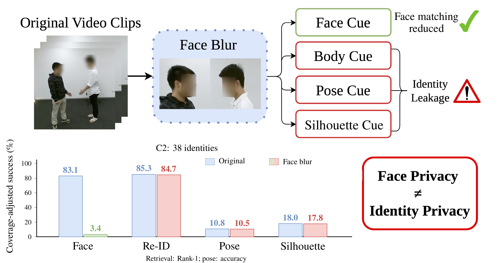
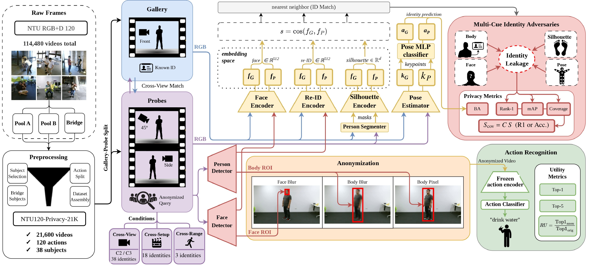
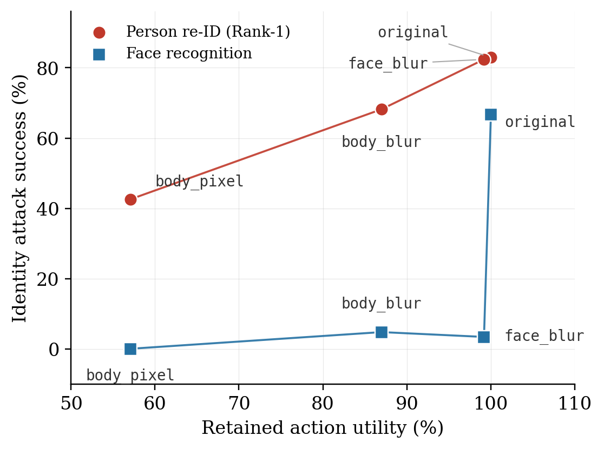
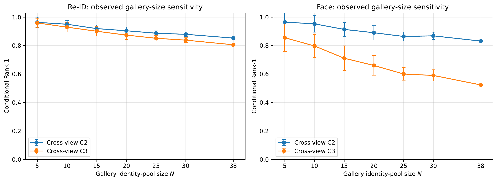

<h1 align="center">Anonymized but Not Anonymous: Multi-Cue Identity Leakage in Privacy-Preserving Action Recognition</h1>

<p align="center">
  <b><a href="https://safwanx.github.io/">Safwan Nabeel</a></b><sup>1</sup> &nbsp;
  <b>Farah AlShiha</b><sup>2</sup> &nbsp;
  <b><a href="https://muzammilbehzad.com/">Muzammil Behzad</a></b><sup>1</sup>
</p>

<p align="center">
  <sup>1</sup>King Fahd University of Petroleum and Minerals, Dhahran, Saudi Arabia &nbsp;
  <sup>2</sup>Columbia University, New York, NY, USA
</p>

<p align="center"><b>Asian Conference on Computer Vision (ACCV) 2026</b></p>

<p align="center">
  <a href="https://brain-lab-ai.github.io/Anonymized-But-Not-Anonymous/"><strong>Project Page</strong></a> &nbsp;•&nbsp;
  <a href="https://github.com/BRAIN-Lab-AI/Anonymized-But-Not-Anonymous"><strong>Code</strong></a> &nbsp;•&nbsp;
  <span><strong>Paper</strong> (coming soon)</span> &nbsp;•&nbsp;
  <a href="results/README.md"><strong>Results</strong></a> &nbsp;•&nbsp;
  <a href="docs/REPRODUCING.md"><strong>Reproduction</strong></a>
</p>

<p align="center">
  <a href="https://github.com/BRAIN-Lab-AI/Anonymized-But-Not-Anonymous"></a>
  <a href="https://brain-lab-ai.github.io/Anonymized-But-Not-Anonymous/"></a>
  
  
  
  <a href="LICENSE"></a>
  <a href="https://github.com/BRAIN-Lab-AI/Anonymized-But-Not-Anonymous/actions/workflows/checks.yml"></a>
</p>

<p align="center">
  
</p>
<p align="center">
  <sub>Reducing face matching does not remove every identity cue. Bars compare original and face-blurred C2 probes with the same 38-identity gallery. Values are coverage-adjusted Rank-1 for retrieval and accuracy for pose. These are complementary attack measurements, not one common privacy scale.</sub>
</p>

---

## News

- **2026-09:** Evaluation code, protocol manifests, and saved results released.
- **2026:** Accepted to the Asian Conference on Computer Vision (ACCV 2026).

## Abstract

Hiding a person's face can preserve action recognition without preventing identification from other visual cues. We study this gap with NTU120-Privacy-21K, a reproducible protocol of 21,600 videos covering all 120 NTU RGB+D 120 actions. It tests face, appearance, RGB-pose, and silhouette matching across viewpoints, setups, and action ranges, reporting both attack success and feature-extraction coverage. On cross-view C2, face blur reduces coverage-adjusted face Rank-1 from 83.1% to 3.4%, while person re-identification remains at 84.7%, compared with 85.3% on unmodified video. DeepPrivacy2 reduces matched C2 face and appearance Rank-1 to 6.4% and 14.2% with nearly complete feature coverage, although identity matching remains possible. Its action utility also depends on how the recognizer is trained: adapting the VideoMAEv2 classification head raises Top-1 from 41.2% to 59.4%, compared with 67.8% on clean video. Pose-based utility and Privacy Beyond Pixels provide complementary tests. The results motivate evaluating multiple identity cues and separating information loss from recognizer mismatch. They measure linkability in the tested setting, not a formal privacy guarantee.

## Key Contributions

- **NTU120-Privacy-21K.** A reproducible NTU protocol covering all 120 actions, with fixed identity-matching splits and explicit gallery sizes.
- **Multi-cue evaluation.** Attack success is related to descriptor coverage, action-informed pose baselines, and gallery size.
- **Learned anonymization and utility controls.** C2 experiments with learned RGB anonymization (DeepPrivacy2), adapted action recognition, and pose-based utility, together with a separate Privacy Beyond Pixels feature-space evaluation.

## Table of Contents

[Method Overview](#method-overview) &nbsp;|&nbsp; [Quick Start](#quick-start-no-dataset-or-gpu-required) &nbsp;|&nbsp; [Benchmark](#the-ntu120-privacy-21k-benchmark) &nbsp;|&nbsp; [Results](#results) &nbsp;|&nbsp; [Reproducing](#reproducing-the-experiments) &nbsp;|&nbsp; [Repository Structure](#repository-structure) &nbsp;|&nbsp; [Citation](#citation)

---

## Method Overview

<p align="center">
  
</p>
<p align="center">
  <sub>RGB-baseline evaluation pipeline. The original gallery supplies identity references or pose-classifier training data; held-out probes are evaluated before and after anonymization. Privacy measurements combine attack success and coverage, while a frozen action encoder measures utility. C2 extensions add DP2, a temporal pose CNN, and utility-head adaptation. PBP is evaluated separately in feature space.</sub>
</p>

**Threat model.** The attacker receives a held-out probe and assigns it to one of the known people in a labeled, unmodified C1/R1 gallery. This is a closed-set linkability test: identities occur in both gallery and probe by construction. No identity model is trained on anonymized probes.

| Cue | Attack | How it matches |
| :--- | :--- | :--- |
| Face | ArcFace | Cosine retrieval of 512-d descriptors |
| Appearance | OSNet (MSMT17-pretrained) | Cosine retrieval of 512-d descriptors |
| RGB pose | YOLOv11m-pose keypoints | MLP classifier; temporal CNN on C2 |
| Temporal silhouette | GaitBase (CASIA-B checkpoint) | Cosine retrieval of silhouette-sequence descriptors |

Since most NTU actions are not walking, the silhouette attack is read as temporal-silhouette/body-dynamics matching rather than pure gait recognition.

**Coverage.** An attack can fail because its extractor finds no usable descriptor. With coverage $C$ (fraction of probes yielding descriptors) and conditional success $S$, the end-to-end score is $S_{\mathrm{cov}} = C \cdot S$. We report coverage alongside success so that low scores caused by failed extraction are visible.

| Anonymizer | Space | Evaluated on |
| :--- | :--- | :--- |
| Face blur (71×71 Gaussian) | RGB | All four protocols |
| Body blur (51×51 Gaussian) | RGB | All four protocols |
| Body pixelation (about 1/12 resolution) | RGB | All four protocols |
| DeepPrivacy2 (`FB_cse`, full body) | RGB | Cross-view C2 |
| Privacy Beyond Pixels | VideoMAEv2 features | Cross-view C2, feature space only |

DP2 means DeepPrivacy2; **it does not provide differential privacy**.

## Quick Start: no dataset or GPU required

With Python 3.10 or newer, from the repository root:

```bash
python -m unittest discover -s analysis -p 'test_*.py' -v
python tools/check_project.py
```

These checks validate protocol composition, corrected chance controls, saved result integrity, and repository structure. They do not rerun GPU experiments. Regenerate the CPU audit separately with:

```bash
python analysis/protocol_audit.py --output-dir outputs/protocol_audit
```

## The NTU120-Privacy-21K Benchmark

NTU120-Privacy-21K is a fixed evaluation protocol built on NTU RGB+D 120. It selects 21,600 videos that retain all 120 action labels and repeated identities across recording conditions: 38 subjects, six setups, three cameras, and two replications.

| Component | Setups | Actions | Subjects | Videos |
| :--- | :--- | :--- | ---: | ---: |
| Pool A | S007, S011 | A001–A060 | 14 | 9,000 |
| Pool B | S029, S030 | A061–A120 | 25 | 11,880 |
| Bridge | S001, S002 | A001–A060 | 2 | 720 |
| **Total** | 6 | 120 | 38 | 21,600 |

Component subject sets overlap; the total counts unique subjects.

| Protocol | Original gallery | Probe | Gallery/probe videos | IDs |
| :--- | :--- | :--- | ---: | ---: |
| Cross-view C2 | C1, R1 | C2, R2 | 3,600/3,600 | 38 |
| Cross-view C3 | C1, R1 | C3, R2 | 3,600/3,600 | 38 |
| Cross-setup | Source setup, C1/R1 | Target setup, C2/R2 | 1,140/1,140 | 18 |
| Cross-range | A001–A060, C1/R1 | A061–A120, C2/R2 | 240/240 | 3 |

C denotes camera and R replication. Gallery sizes differ substantially, so each protocol is reported separately; the three-identity cross-range test is a diagnostic, not large-gallery evidence. The fixed filename lists are in [`protocol/`](protocol/README.md).

**Data availability.** NTU RGB+D 120 videos, skeletons, frames, detection caches, and pretrained weight downloads are **not included**. Obtain them from their owners under the relevant terms. Saved CSVs support table and protocol checks without these inputs. Full pixel-based reproduction requires restoring them; a fresh end-to-end GPU installation has not been validated for this release layout.

## Results

All values are percentages. Full tables with every metric are in [`results/`](results/README.md).

### Face blur hides faces, not appearance

Cross-view C2, 38 identities. Each cell is end-to-end attack success [descriptor coverage]: coverage-adjusted Rank-1 for face, re-ID, and silhouette, and coverage-adjusted accuracy for pose.

| Attack | Original | Face blur | Body blur | Body pixel |
| :--- | ---: | ---: | ---: | ---: |
| Face | 83.1 [99.9] | 3.4 [70.7] | 7.0 [75.2] | 0.0 [4.2] |
| Re-ID | 85.3 [100.0] | **84.7** [100.0] | 72.1 [100.0] | 49.4 [100.0] |
| Pose MLP | 10.8 [100.0] | 10.5 [100.0] | 10.7 [100.0] | 0.2 [21.6] |
| Silhouette | 18.0 [99.9] | 17.8 [99.9] | 10.4 [99.9] | 0.0 [0.3] |

Zero coverage means an unavailable descriptor, not certified identity removal. Under body pixelation, face, pose, and silhouette coverage collapses, so low scores combine extraction failure with changes in success on covered probes.

<details>
<summary><b>All four protocols</b></summary>

<br>

| Protocol | Attack | Original | Face blur | Body blur | Body pixel |
| :--- | :--- | ---: | ---: | ---: | ---: |
| C2 (38 IDs) | Face | 83.1 [99.9] | 3.4 [70.7] | 7.0 [75.2] | 0.0 [4.2] |
| | Re-ID | 85.3 [100.0] | 84.7 [100.0] | 72.1 [100.0] | 49.4 [100.0] |
| | Pose MLP | 10.8 [100.0] | 10.5 [100.0] | 10.7 [100.0] | 0.2 [21.6] |
| | Silhouette | 18.0 [99.9] | 17.8 [99.9] | 10.4 [99.9] | 0.0 [0.3] |
| C3 (38 IDs) | Face | 50.3 [96.1] | 3.4 [87.4] | 2.5 [52.5] | 0.0 [3.4] |
| | Re-ID | 80.6 [100.0] | 80.1 [100.0] | 64.3 [100.0] | 35.7 [100.0] |
| | Pose MLP | 4.6 [100.0] | 4.6 [100.0] | 4.2 [100.0] | 1.7 [22.3] |
| | Silhouette | 6.2 [100.0] | 6.4 [100.0] | 6.1 [100.0] | 0.1 [0.7] |
| Cross-setup (18 IDs) | Face | 87.8 [100.0] | 8.1 [68.7] | 16.9 [74.3] | 0.4 [3.2] |
| | Re-ID | 45.3 [100.0] | 47.0 [100.0] | 35.5 [100.0] | 26.7 [100.0] |
| | Pose MLP | 9.5 [100.0] | 9.1 [100.0] | 10.8 [100.0] | 2.1 [26.3] |
| | Silhouette | 14.4 [100.0] | 13.2 [100.0] | 11.0 [100.0] | 0.0 [0.0] |
| Cross-range (3 IDs) | Face | 97.9 [100.0] | 27.1 [61.7] | 32.5 [62.9] | 1.2 [4.2] |
| | Re-ID | 62.1 [100.0] | 62.9 [100.0] | 49.2 [100.0] | 58.3 [100.0] |
| | Pose MLP | 25.4 [100.0] | 26.7 [100.0] | 32.1 [100.0] | 1.7 [13.8] |
| | Silhouette | 40.8 [100.0] | 35.8 [100.0] | 39.2 [100.0] | 0.0 [0.0] |

Silhouette here uses segmentation-derived masks, unlike the matched DeepPrivacy2 run below.

</details>

### DeepPrivacy2 reduces several attacks, leaving residual linkability

Matched cross-view C2 comparison. Success is conditional on a valid descriptor: Rank-1 for retrieval and ordinary accuracy for pose. Brackets give nominal 95% Wilson intervals over covered probes; shared subjects make these descriptive, not cluster-adjusted population intervals.

| Endpoint | Metric | Clean | DP2 | Coverage clean/DP2 |
| :--- | :--- | ---: | ---: | ---: |
| Face / ArcFace | R1 | 83.2 [81.9, 84.4] | 6.4 [5.6, 7.2] | 99.94/99.97 |
| Appearance / OSNet | R1 | 85.2 [84.0, 86.3] | 14.2 [13.1, 15.4] | 100.00/100.00 |
| Pose / MLP | Acc. | 10.3 [9.4, 11.4] | 9.0 [8.1, 10.0] | 100.00/100.00 |
| Pose / temporal CNN | Acc. | 11.5 [10.5, 12.6] | 8.8 [7.9, 9.7] | 100.00/100.00 |
| Silhouette / GaitBase | R1 | 26.3 [24.9, 27.7] | 8.5 [7.6, 9.4] | 99.94/99.94 |

DP2 descriptor coverage is 99.94–100%, so these reductions are not explained by widespread extraction failure. The DP2 balanced pose accuracies (7.84% MLP, 7.75% temporal CNN) remain above the 4.86% action-conditioned point null.

### Much of the zero-shot utility loss is recoverable

VideoMAEv2 stays frozen in every row; only the action head changes in the adapted row. Retained utility (RU) uses each model's clean reference. Pose is extracted from RGB, not taken from NTU skeleton annotations.

| Model | Head training | Test | Top-1 | Top-5 | Mean-class | RU |
| :--- | :--- | :--- | ---: | ---: | ---: | ---: |
| VideoMAEv2 | Clean | Clean | 67.8 | 93.4 | 67.8 | 100.0 |
| VideoMAEv2 | Clean | DP2 | 41.2 | 70.6 | 41.0 | 60.8 |
| VideoMAEv2 | DP2 | DP2 | **59.4** | 88.9 | 59.3 | 87.7 |
| Pose MLP | Clean | Clean | 51.2 | 79.6 | 51.3 | 100.0 |
| Pose MLP | Clean | DP2 | 47.9 | 75.9 | 48.1 | 93.5 |

The adapted head recovers 68.7% of the 26.58-point gap to the clean reference. Under zero-shot transfer, face blur retains 98.4% of clean C2 Top-1 and body pixelation 57.1%.

### Privacy Beyond Pixels: feature-space linkability

PBP releases anonymized VideoMAEv2 features rather than video, so it is evaluated in feature space. These scores are not ranked against the pixel-space attacks above. All feature coverage is 100%.

| Endpoint | Head | Clean features | PBP features | Same-head RU |
| :--- | :--- | ---: | ---: | ---: |
| Latent R1 | Not applicable | 37.6 | 32.4 | – |
| Action Top-1 | Clean-trained | 67.8 | 66.9 | 98.7 |
| Action Top-1 | PBP joint | 62.8 | 65.8 | 104.8 |

The jointly trained head's same-head ratio is not an improvement over the clean-trained head's 66.9% accuracy.

### Trade-off and gallery size

<table>
  <tr>
    <td width="42%" valign="top">
      
      <br><sub>Original baseline trade-off: mean C2/C3 coverage-adjusted face and re-ID R1 versus retained zero-shot action utility, with 38 identities in each split. Curves connect measured settings, not an optimized frontier. DP2 and PBP are evaluated separately, not plotted here.</sub>
    </td>
    <td width="58%" valign="top">
      
      <br><sub>Observed gallery-size sensitivity on original cross-view clips. Error bars show standard deviation over 30 identity-pool draws for N&lt;38; N=38 has one full-pool realization. No out-of-range projections are plotted.</sub>
    </td>
  </tr>
</table>

### Reading these results

- These are closed-set linkability tests with 38, 18, or 3 gallery identities. They do not establish performance across clothing changes, unseen subjects, unconstrained environments, or open-set galleries.
- DeepPrivacy2 and PBP results cover cross-view C2 only.
- Low attack success is evidence against the tested attack, not a guarantee of anonymity. Nothing here is a formal privacy guarantee.
- New learned-head results use one seed; repeated-seed uncertainty is not measured.

## Reproducing the experiments

[docs/REPRODUCING.md](docs/REPRODUCING.md) covers paths, GPU stages, and interpretation. [environments/README.md](environments/README.md) lists the recorded runtime (Python 3.10, PyTorch 2.1.2, CUDA 12.1) and how to fetch the pinned external sources. [jobs/README.md](jobs/README.md) describes the SLURM templates.

New experiments write to `outputs/`, not the published results. External sources and model downloads default to `~/.cache/accv/`, outside this checkout.

## Repository Structure

```text
Anonymized-But-Not-Anonymous/
├── pipeline/            extraction, anonymization, attack, and utility stages
├── gait_integration/    GaitBase temporal-silhouette attack
├── pbp_integration/     Privacy Beyond Pixels feature-space evaluation
├── analysis/            protocol and chance audit, coverage decomposition, output checks
├── protocol/            filename metadata and fixed splits; no videos or skeletons
├── results/             baseline, matched-C2, PBP, analysis, and timing tables
├── jobs/                portable SLURM experiment templates
├── environments/        dependencies, pinned external sources, compatibility patches
├── tools/               source fetching, release checks, job submission
├── artifacts/           notes and integrity manifest for optional local binaries
├── docs/                reproduction guide
├── assets/              figures and project page files
└── index.html           project page
```

Component guides: [pipeline](pipeline/README.md), [GaitBase](gait_integration/README.md), [PBP](pbp_integration/README.md), [artifacts](artifacts/README.md).

## Citation

```bibtex
@inproceedings{nabeel2026anonymized,
  title     = {Anonymized but Not Anonymous: Multi-Cue Identity Leakage in
               Privacy-Preserving Action Recognition},
  author    = {Nabeel, Safwan and AlShiha, Farah and Behzad, Muzammil},
  booktitle = {Asian Conference on Computer Vision (ACCV)},
  year      = {2026}
}
```

Metadata is also in [CITATION.cff](CITATION.cff). The official paper URL and DOI will be added when available.

## License

Original code is released under the [MIT License](LICENSE). Dataset media, pretrained weights, external code, and publisher or template materials are not relicensed by that file. See the [third-party notices](THIRD_PARTY.md).

## Acknowledgements

We thank King Fahd University of Petroleum and Minerals (KFUPM) for its support.

## Contact

For questions, please open a [GitHub issue](https://github.com/BRAIN-Lab-AI/Anonymized-But-Not-Anonymous/issues).
